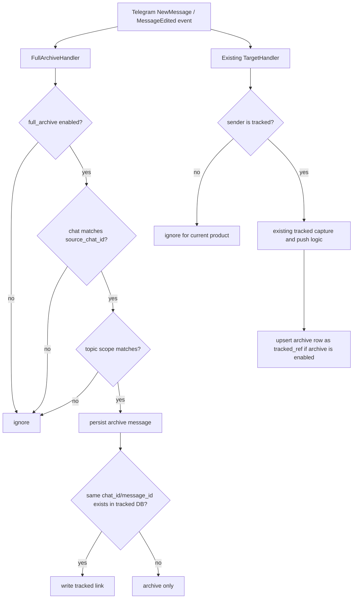

# 全量消息归档架构文档

## 当前基线

现有存储模型以 tracked users 为中心：

- `telegram_watch.runner._TargetHandler` 接收 `events.NewMessage`。
- 如果 `sender_id` 不在配置的 tracked user 集合中，就直接返回。
- `_capture_message()` 只为 tracked 消息采集正文、reply snapshot、媒体。
- `telegram_watch.storage.persist_message()` 写入现有 `messages` 和 `media` 表。

全量归档应该并行运行在这个路径旁边，而不是塞进 tracked-user 过滤逻辑里面。

## 推荐运行流程



`FullArchiveHandler` 和 `_TargetHandler` 是两条旁路。归档失败只能写日志，不能让 tracked-user 推送链路失败。为了处理事件 handler 的执行顺序，tracked 消息成功写入 tracked DB 后，会再对 archive row 做一次 upsert：如果同一条消息已被 full archive 先写成普通 `archive` payload，这一步会把它改成 `tracked_ref` 并清空重复正文。

`FullArchiveHandler` 同时处理 `events.NewMessage` 和 `events.MessageEdited`。编辑事件使用同一个 `(chat_id, message_id)` upsert 路径：普通 archive row 会更新正文、媒体元数据和 topic 字段；如果同一消息已经是 `tracked_ref`，仍不在 full archive 重复保存 tracked 正文或媒体，context 查询以 tracked DB 当前内容为准。

daemon 启动时必须先做一次只读 archive health preflight。如果 `archive-status` 等价结果是 degraded，daemon 继续启动现有 tracked-user watcher，但本次运行不注册 `FullArchiveHandler`，也不执行 tracked-user 写入后的 archive relink。这样 full archive 损坏不会拖垮现有推送链路，也不会在缺失 shard、隐藏 shard、坏 link 或 schema 损坏状态上继续追加新归档数据。用户需要先运行 `archive-status` 和 `archive-repair --dry-run` 处理原因，再重新启动 daemon。

## 文件布局

推荐目标布局：

```text
data/
  tgwatch.sqlite3
  media/

  full_archive/
    manifest.sqlite3
    shards/
      group_-1001234567890/
        2026-05.sqlite3
        2026-06.sqlite3
        2026-06-002.sqlite3
```

`manifest.sqlite3` 保存分片注册表和跨分片元数据。各个 shard 保存具体消息行。

第一版 shard 粒度固定为“群组 + 月份 + 序号”。`topic_id` 是消息行级字段，用于过滤和查询，不参与文件分片。这样一个 forum 群组即使选择多个 Topic，也不会为每个 Topic 生成单独文件，避免文件数量过多。

`archive_shards.path` 新写入时保存相对 `root_dir` 的路径，例如 `shards/group_-1001234567890/2026-05.sqlite3`。读取层必须同时兼容早期 absolute path 和新的 root-relative path。这样用户整体移动、备份、恢复 `full_archive/` 文件夹后，`archive-status`、`archive-context` 和 `archive-repair` 仍能按新的 `root_dir` 找到 shard，不会因为旧机器绝对路径变化误报缺失。

Manifest 还必须记录归档曾连接过的 tracked DB。这样即使用户把 `full_archive/` 文件夹单独拿出来检查，也能知道这些 shard 原本应回连哪个 tracked 数据库；`archive-status` 默认只显示 link 数量，不打印本机路径。

## Manifest 数据库

### `archive_shards`

```sql
CREATE TABLE archive_shards (
    shard_id TEXT PRIMARY KEY,
    chat_id INTEGER NOT NULL,
    topic_id INTEGER,
    path TEXT NOT NULL,
    starts_at TEXT NOT NULL,
    ends_at TEXT,
    message_count INTEGER NOT NULL DEFAULT 0,
    file_size_bytes INTEGER NOT NULL DEFAULT 0,
    status TEXT NOT NULL DEFAULT 'active',
    created_at TEXT NOT NULL,
    closed_at TEXT
);

CREATE INDEX idx_archive_shards_scope_time
    ON archive_shards(chat_id, topic_id, starts_at);
```

### `tracked_db_links`

记录 full archive 当前连接的是哪一个 tracked database。

```sql
CREATE TABLE tracked_db_links (
    link_id TEXT PRIMARY KEY,
    tracked_db_path TEXT NOT NULL,
    created_at TEXT NOT NULL,
    last_checked_at TEXT,
    status TEXT NOT NULL DEFAULT 'active'
);
```

写入规则：

- 每次 full archive 实际持久化消息时，如果传入 tracked DB path，就 upsert 一条 active link；
- 新写入的 `tracked_db_path` 应保存为相对 `root_dir` 的路径，例如 `../tgwatch.sqlite3`；读取层必须兼容早期 absolute path。这样用户整体移动同一个 `data/` 或项目目录后，`archive-context` 仍能把 `tracked_ref` 回连到当前 config 指定的 tracked DB；
- `tracked_db_links` 必须在 shard 写入成功后再更新；如果 shard 写入失败，不能只留下 tracked DB link，避免 `archive-status` 把未完成写入误判成有效连接；
- 不因为 `archive-status`、`archive-context`、`archive-repair` 或 dry-run backfill 创建或更新该表；
- 状态输出只展示 link 数量，避免把用户本机路径作为常规日志打印出来。
- 如果早期或损坏的 manifest 缺少 `tracked_db_links` 表，`archive-status` 必须标记 degraded；`archive-repair --apply` 可以创建空表恢复 schema，但不能猜测补充历史 link 数据。

## Shard 数据库 schema

### `archive_messages`

```sql
CREATE TABLE archive_messages (
    chat_id INTEGER NOT NULL,
    message_id INTEGER NOT NULL,
    topic_id INTEGER,
    sender_id INTEGER,
    date TEXT NOT NULL,
    text TEXT,
    raw_text TEXT,
    message_kind TEXT NOT NULL DEFAULT 'message',
    reply_to_msg_id INTEGER,
    reply_to_top_id INTEGER,
    is_forum_topic_link INTEGER NOT NULL DEFAULT 0,
    has_media INTEGER NOT NULL DEFAULT 0,
    tracked_db_path TEXT,
    tracked_message_chat_id INTEGER,
    tracked_message_id INTEGER,
    payload_mode TEXT NOT NULL DEFAULT 'archive',
    created_at TEXT NOT NULL,
    updated_at TEXT NOT NULL,
    PRIMARY KEY (chat_id, message_id)
);

CREATE INDEX idx_archive_messages_scope_date
    ON archive_messages(chat_id, topic_id, date);

CREATE INDEX idx_archive_messages_chat_date
    ON archive_messages(chat_id, date);

CREATE INDEX idx_archive_messages_sender_date
    ON archive_messages(sender_id, date);

CREATE INDEX idx_archive_messages_tracked_ref
    ON archive_messages(tracked_message_chat_id, tracked_message_id);
```

`payload_mode` 取值：

- `archive`：这行 full archive 自己保存正文。
- `tracked_ref`：这条 Telegram 消息已经存在于 tracked DB；archive 行只保留时间线和引用元数据，通过 link 字段回连真实 tracked payload。
- `tombstone`：预留给未来删除标记。

### `archive_tracked_links`

```sql
CREATE TABLE archive_tracked_links (
    chat_id INTEGER NOT NULL,
    message_id INTEGER NOT NULL,
    tracked_db_path TEXT NOT NULL,
    tracked_chat_id INTEGER NOT NULL,
    tracked_message_id INTEGER NOT NULL,
    linked_at TEXT NOT NULL,
    PRIMARY KEY (chat_id, message_id, tracked_db_path),
    FOREIGN KEY (chat_id, message_id)
        REFERENCES archive_messages(chat_id, message_id)
        ON DELETE CASCADE
);

CREATE INDEX idx_archive_tracked_links_tracked
    ON archive_tracked_links(tracked_chat_id, tracked_message_id);
```

link table 让连接关系显式化，也为未来多个 tracked DB 的场景留下空间。

### `archive_media`

第一阶段不下载全量媒体文件，但需要保存轻量媒体元数据，避免上下文时间线只能看到“有媒体”而不知道大致类型。

```sql
CREATE TABLE archive_media (
    chat_id INTEGER NOT NULL,
    message_id INTEGER NOT NULL,
    media_index INTEGER NOT NULL,
    media_kind TEXT NOT NULL,
    mime_type TEXT,
    file_size INTEGER,
    file_name TEXT,
    created_at TEXT NOT NULL,
    updated_at TEXT NOT NULL,
    PRIMARY KEY (chat_id, message_id, media_index),
    FOREIGN KEY (chat_id, message_id)
        REFERENCES archive_messages(chat_id, message_id)
        ON DELETE CASCADE
);
```

规则：

- 只保存 Telegram message 上可直接读取的元数据，不调用 `download_media`；
- 普通 archive row 可以保存 `archive_media`；
- `payload_mode = 'tracked_ref'` 时不在 full archive 重复保存媒体元数据，媒体完整信息从 tracked DB 的 `media` 表读取；
- 如果一条普通 archive row 后续 relink 成 `tracked_ref`，必须删除这条消息在 `archive_media` 中的旧元数据。
- 一条消息一旦成为 `tracked_ref`，后续同一 `(chat_id, message_id)` 的 archive-only 观测不能把它降级回 `archive`。如果 tracked DB 暂时不可读、路径变化或当前配置无法解析该 tracked row，应保留既有 `tracked_ref` 和 link 元数据，让 `archive-status` / `archive-context` 报告可诊断错误，而不是重新保存 tracked 正文或媒体。

### `archive_senders`

这个表可选，但有助于稳定展示 sender 信息。

```sql
CREATE TABLE archive_senders (
    sender_id INTEGER PRIMARY KEY,
    username TEXT,
    display_name TEXT,
    first_seen_at TEXT NOT NULL,
    last_seen_at TEXT NOT NULL
);
```

如果保存 sender snapshot 会增加额外 API 调用，第一阶段可以先跳过。

## 连接 tracked DB 和 full archive DB

SQLite 支持在同一个连接里 `ATTACH DATABASE` 另一个数据库文件。

示例查询：

```sql
ATTACH DATABASE 'data/tgwatch.sqlite3' AS tracked;

SELECT
    a.date,
    a.sender_id,
    COALESCE(t.text, a.text) AS text,
    a.payload_mode,
    t.replied_text
FROM archive_messages AS a
LEFT JOIN tracked.messages AS t
  ON t.chat_id = a.tracked_message_chat_id
 AND t.message_id = a.tracked_message_id
WHERE a.chat_id = ?
  AND a.date BETWEEN ? AND ?
ORDER BY a.date ASC;
```

这样未来工具可以直接问：

“展示 tracked message X 前后 10 分钟的所有群消息。”

为了严格去重，当 `payload_mode = 'tracked_ref'` 时，`archive_messages.text` 必须为 `NULL`；上面的查询会从 attached tracked database 里取 tracked 文本。注意：tracked DB 中的 `text` 本身也可能合法为 `NULL`（例如媒体-only 或空文本消息），所以解析是否成功不能用 `text IS NULL` 判断，而必须用 tracked DB 中是否存在对应 `(chat_id, message_id)` 行判断。即使旧库或损坏库里的 `tracked_ref` 行残留了 archive 侧 `text`，`archive-context` 也不能回退显示这份文本，只能使用匹配 tracked DB 的 payload；否则会重新引入 tracked 消息正文重复和 stale 上下文风险。

第一版提供只读 CLI：

```bash
python -m tgwatch archive-context \
  --config config.toml \
  --chat -1001234567890 \
  --message-id 12345 \
  --before-minutes 10 \
  --after-minutes 5
```

命令流程：

1. 从 tracked DB 读取目标 `(chat_id, message_id)` 的时间点；如果当前 tracked DB 不存在、不可读、缺少 `messages` 表，或 `messages` 表缺少定位所需的 `chat_id` / `message_id` / `date` 任一列，命令必须报告明确 tracked DB 错误；只有 tracked DB 可读但目标行不存在时，才报告 tracked message not found；
2. 根据时间窗口读取 full archive manifest 中覆盖该范围的 shard；CLI 必须先打印实际查询窗口，包括中心 tracked message 时间点、`since`、`until`、before/after 分钟数和 Topic filter。时间范围和过滤条件分两行输出，避免终端自动换行导致可读性下降，也避免用户只看 rows 时误判上下文覆盖范围；
3. 对每个 shard 只读 `ATTACH` 当前 config 指定的 tracked DB；
4. `payload_mode = 'tracked_ref'` 时，只有当 archive row 记录的 `tracked_db_path` 与当前 config 的 tracked DB 路径等价，才允许用 attached tracked DB 正文；等价包括旧 absolute path 精确匹配，或新 root-relative path 按当前 `root_dir` 解析后匹配。普通 archive row 使用 archive 自己的正文；
5. 普通 archive row 如果带有 `archive_media` 元数据，CLI 输出中必须显示媒体摘要，例如 kind / MIME / size / file name。`tracked_ref` 的媒体继续以 tracked DB 为准，第一版不在 context CLI 里重复展开 tracked media；即使旧库或损坏库里残留了同一 `tracked_ref` 的 `archive_media` 行，`archive-context` 也必须忽略这些 archive 侧媒体元数据；
6. 按 `date, message_id` 输出时间线，并在每条消息的元数据行显示目标行标记、`topic_id` 和 reply/thread 线索。`Target` 列用 `*` 标出命令指定的 tracked message 是否出现在 archive 时间线里；如果没有出现，命令仍可基于 tracked DB 时间点输出附近上下文，但必须明确显示 `Target archived row: no`，避免用户误以为目标行已被 full archive 覆盖。传入 `--topic-id` 时，如果目标 archived row 存在但属于其他 Topic、General 或未知 Topic，命令必须额外打印 Topic mismatch 诊断并返回非零，提示用户改用正确 Topic 或整群查询；否则人工可能把错误 Topic 的邻近消息当成目标上下文。`topic_id IS NULL` 的行显示为 `-`，表示非 forum、General、未知 Topic 或暂时无法归类；这和“不传 `--topic-id` 时查询整群时间线”是两个不同语义。`reply_to_msg_id` / `reply_to_top_id` 显示为只读 `Reply` 列，帮助人工判断短消息是否接在某条消息或某个 thread 后面。正文和媒体摘要输出在下一行的 `Text:` 字段中，并做空白归一化和长度截断，避免长消息把元数据列挤乱。`tracked_ref` 行如果从 tracked DB 读到了 `replied_text`，必须在 `Text:` 下方输出独立的 `Reply snapshot:` 行，同样做空白归一化和长度截断；不能把 reply snapshot 塞进元数据列，否则会破坏表格对齐，也会让短消息上下文不够醒目。

如果时间窗口覆盖多个 shard，命令必须跨 shard 汇总并统一排序。如果某个覆盖窗口的 shard 缺失、无法读取，或 manifest/schema 读取失败，命令可以输出已读到的上下文，但必须明确报告 skipped shard 或 error，并以非零退出码结束，避免用户误以为上下文完整。`tracked_ref` 行必须能解析到 tracked DB 中的对应行；如果 tracked DB 不存在、不可读、缺少 `messages` 表、缺少 `chat_id` / `message_id` / `date` / `text` / `replied_text` 任一列、archive row 指向的 tracked DB 与当前 config DB 不一致，或对应 tracked message 缺失，命令必须报告 error 并非零退出。tracked DB 诊断不能打印本机路径，也不能创建空 tracked DB。若对应行存在但正文为 `NULL`，这是合法空文本/媒体-only 消息，不应被误报为解析失败。

读取 `archive_media` 时不能为每条消息拼接无限增长的 `OR` 条件。忙碌群组的上下文窗口可能超过 1000 条消息，容易碰到 SQLite expression depth 或变量数量上限；实现必须按 chat 分组并对 message IDs 分块查询。

这个命令不连接 Telegram，不写入任何 DB，不下载媒体。

## 分片选择

Shard key：

```text
chat_id + month(date) + sequence
```

Topic 不参与 shard key。Topic 过滤发生在写入前。整群窗口查询依赖 `archive_messages(chat_id, date)` 索引；Topic 窗口查询依赖 `archive_messages(chat_id, topic_id, date)` 索引。不能只保留 `(chat_id, topic_id, date)`，因为不传 Topic 时 SQLite 只能稳定使用 `chat_id` 前缀，无法有效利用 `date` 范围。

查询 API 的语义固定为：

- 不传 `topic_id`：返回整群时间线，不按 Topic 过滤；
- 传入具体 `topic_id`：只返回该 Topic 的消息，且 `topic_id` 必须大于 `1`；
- `topic_id IS NULL` 的行代表非 forum、General、未知 Topic 或暂时无法归类的消息。第一阶段不单独提供“只查 NULL Topic”的高级查询接口，避免把 `None` 同时当成“不过滤”和“只查 NULL”。

默认：

```text
group_-1001234567890/2026-05.sqlite3
```

达到阈值后：

```text
group_-1001234567890/2026-05-002.sqlite3
```

切分阈值：

- 按自然月切分；
- 当 message count >= 500,000 时切分；
- 当 SQLite 分片真实磁盘占用 >= 1 GB 时切分。这里的占用必须包含主 `.sqlite3` 文件以及 SQLite WAL 模式产生的 `-wal` / `-shm` sidecar 文件，不能只看主文件大小。

## 为什么不只用一个巨大数据库

SQLite 可以处理很大的数据库，但这个项目是本地个人工具，运营可控性比理论上限更重要：

- 旧数据删除要简单；
- 备份和复制成本要可预期；
- 单个文件损坏的影响范围要小；
- 人工检查要方便；
- GUI 查询不能误扫多年数据。

## Topic 识别

同时保存两类信息：

- `topic_id`：归一化后的 topic/thread ID，用于过滤和查询。
- 原始 reply header 字段：`reply_to_msg_id`、`reply_to_top_id`、`is_forum_topic_link`。

Topic ID 解析规则：

1. 如果 `reply_to_top_id > 1`，优先使用它。
2. 如果 `reply_to_top_id` 不存在，但 `is_forum_topic_link = true` 且 `reply_to_msg_id > 1`，第一阶段把 `reply_to_msg_id` 作为 best-effort Topic root ID 使用。这是为了兼容 Telegram 只给 topic linkage、不带 top ID 的消息形态。
3. 否则存 `NULL`，表示 General、非 Topic 或未知。

`1` 是 Telegram forum General topic 的保留 ID；第一阶段把它归为 `NULL`，并且不允许 `capture_scope = "topics"` 配置 `topic_ids = [1]`。如果用户需要 General 附近的上下文，应使用 `whole_group` 归档后通过整群时间线查询。

归档消息归一化必须对 Telegram 历史中的异常 message shape 保守处理：

- `message_id`、`date` 或最终 `chat_id` 缺失/不可解析时，这条消息不能形成稳定 `(chat_id, message_id)` 身份，应跳过并计入 invalid；
- event/message 自带 `chat_id = None` 时，允许回退到当前配置的 `source_chat_id`，因为 Telethon 某些事件对象可能把 chat 信息放在事件层；
- `sender_id`、reply/thread 字段或媒体大小不可解析时，不中断归档，保存为 `NULL` / unknown；
- 单条异常消息不能让 `archive-backfill` 整段失败，live capture 也不能影响 tracked-user watcher。

必须保留原始字段。这样未来即使 Topic 判定规则修正，也能不重新拉 Telegram 历史就重新分类。

注意：第一阶段 writer 不维护 Topic metadata cache，因此第 2 条不是强验证。它可能把某些 Telegram 特殊 reply header 误归到 Topic。`archive-context` 会同时显示 `topic_id`、`reply_to_msg_id`、`reply_to_top_id`，真实 Telegram QA 必须检查 forum 群组里的 Topic 归类是否符合预期。未来如果引入 Topic metadata cache，可以用 `list-topics` 返回的 topic root/top message 对这些 best-effort 行做二次校正。

## Edited messages

Telegram 允许用户编辑已发送消息。第一阶段处理策略：

- live capture 注册 `events.MessageEdited`；
- 编辑事件按 `(chat_id, message_id)` 幂等更新同一 archive row，不新增消息计数；
- Topic 过滤仍适用，编辑事件不在配置 Topic 范围内时忽略；
- archive-only 行更新 `text`、`raw_text`、`reply/topic` 和轻量媒体元数据；
- `tracked_ref` 行继续只保存引用，不重复保存 tracked 正文/媒体。是否同步 tracked DB 内的 tracked message 正文属于现有 tracked-user watcher 的独立行为，第一阶段不改变。

## Backfill

Backfill 使用 `client.iter_messages(source_chat_id)`，并受配置限制。

规则：

- live capture 应尽快启动；
- backfill 可以在 live capture 前执行，也可以 live capture 启动后异步执行；
- 写入必须基于 `(chat_id, message_id)` 幂等；
- 历史拉取受 message count 或 date 边界限制；
- Topic 过滤同样适用于 backfill。
- 大批量 backfill 必须主动降低 `GetHistoryRequest` 频率。第一版对超过 1,000 条的 backfill 显式传入 Telethon `iter_messages(..., wait_time=1.0)`；小批量首次请求保持默认节奏，但一旦遇到 `FloodWaitError`，同一次 backfill 的后续请求也切换到 `wait_time=1.0`，避免刚恢复就再次打到限流。
- 如果 backfill 中途遇到 `FloodWaitError`，命令必须断开前先睡眠并从最后已处理的 `message_id` 继续，而不是让已完成扫描直接丢失。因为默认按新到旧遍历，继续时使用 `offset_id = last_seen_message_id`，避免重复处理已扫描消息。

## 写入并发

全量归档写入不能占用 Telegram event loop，也不能让 tracked-user 推送等待 archive relink。第一版采用 `asyncio.to_thread(...)` 把 SQLite 写入移出事件循环；tracked DB 写入成功后的 relink 作为后台任务调度，不阻塞 realtime queue 或后续推送链路。`_TargetHandler` 必须持有 pending relink task 的强引用，并在 task 完成后清理，避免长时间运行的 daemon 出现后台任务生命周期不明确的问题。daemon 关闭时应对 pending relink 做有界等待：尽量把刚写入 tracked DB 的消息补成 `tracked_ref`，但不能因为 archive SQLite 卡住而无限拖住退出。这个 relink 必须幂等：如果后台任务稍后完成，它把已有 archive row 升级为 `tracked_ref`；如果失败，只记录 warning，下一次 archive 写入、edited event 或 backfill 仍可再次修正同一 `(chat_id, message_id)`。

更高吞吐版本建议演进到单 writer queue：

- event handler 只负责归一化消息并入队；
- writer task 打开 active shard connection；
- writer 尽量批量写入；
- writer 更新 manifest 计数。

这样可以进一步避免多个 event handler 同时写同一个 shard 文件。第一版仍依赖 SQLite `busy_timeout` 和 WAL 降低锁冲突风险。

## WAL 和耐久性

沿用现有 SQLite 策略：

- `PRAGMA journal_mode = WAL`;
- `PRAGMA busy_timeout = 5000`;
- `PRAGMA foreign_keys = ON`;

Shard 主要是追加和 upsert 工作负载，WAL 适合这个场景。

## 状态检查与恢复

`archive-status` 是只读诊断入口，用来回答“归档现在是否可用、哪些分片存在、link 是否建立”。

它必须遵守：

- full archive 关闭时只输出 disabled，不创建 `root_dir`、manifest 或 shard；
- manifest 不存在时输出空状态，不把这当成 tracked watcher 错误；
- manifest 存在时逐个读取 shard，统计 manifest 记录、实际文件大小、实际消息数、`archive` 行、`tracked_ref` 行、link 行和 archive media metadata 行；
- 每个 shard 的 `tracked_ref` 行数必须和 `archive_tracked_links` 行数一致；不一致时标记 degraded。数量一致后，还必须校验 link table 内容是否和 `tracked_ref` 行中的 `tracked_db_path`、`tracked_message_chat_id`、`tracked_message_id` 一致；数量一致但内容 stale/wrong 也必须 degraded。`tracked_ref` 是 timeline 行上的轻量引用，link table 是可查询连接关系，两者缺一边或指向不一致都会降低未来人工/Codex 查询的可靠性；
- `payload_mode='tracked_ref'` 的行必须同时具备 `tracked_db_path`、`tracked_message_chat_id`、`tracked_message_id`。缺任一字段时必须 degraded，并明确报告 incomplete tracked_ref metadata；这种损坏不能由 repair 猜测恢复，只能由后续真实写入/relink 覆盖，或由用户删除重建对应归档数据；
- `payload_mode='tracked_ref'` 的行不能在 `archive_messages.text` 或 `archive_messages.raw_text` 中保留 archive 侧正文。如果旧库、损坏库或中断写入留下这类重复正文，`archive-status` 必须标记 degraded，`archive-repair --apply` 可以安全清空这些派生字段；
- `payload_mode='tracked_ref'` 的行不能在 `archive_media` 中保留 archive 侧媒体元数据；如果旧库、损坏库或中断写入留下这类行，`archive-status` 必须标记 degraded，`archive-repair --apply` 可以安全删除这些派生元数据；
- 统计 manifest 里登记过的 tracked DB link 数量，但不打印具体路径；
- 如果 manifest/shard 已经有归档消息，但没有任何 active tracked DB link，必须标记 degraded，即使当前检查没有传入 tracked DB 路径也一样。正常写入会在 shard 成功后登记 tracked DB link；没有 link 会让未来 `archive-context` 无法可靠判断这批 archive 原本应回连哪个 tracked DB；
- 如果命令由 `config.toml` 调用，还要只读确认当前配置里的 tracked DB 已登记在 manifest 中，且该 DB 文件可读并包含 `archive-context` 需要的 tracked `messages` schema：`chat_id`、`message_id`、`date`、`text`、`replied_text`；如果 tracked DB 缺失、只是空 SQLite 文件，或不是有效 tracked DB，只报告 unreadable/degraded，不能创建空 tracked DB；状态输出只能给出 yes/no/unknown，不能打印本机路径；
- 如果 manifest 登记的 message count 和 shard 实际消息数不一致，标记 degraded；这通常代表上次写入在 shard 成功后、manifest metadata 更新前中断；
- `file_size_bytes` 是便于 status 汇总和 repair 同步的 advisory metadata。由于 WAL/checkpoint 会在连接关闭后改变 SQLite 主文件大小，`archive-status` 不应仅因为 file size 不一致标记 degraded；`archive-repair --apply` 可以把它同步为当前本地事实；
- 每个 shard 只读检查必需索引和可增量 schema 表是否存在；缺少查询索引或可安全补齐的表时标记 degraded，提示需要后续修复；
- shard 文件缺失或 schema 无法读取时标记为 degraded，并继续检查其他 shard；
- 不连接 Telegram，不读取或打印 secrets。

`archive-status` 不负责自动修复。用户可以根据结果删除整个 `root_dir`、备份某些 shard，运行 `archive-repair --apply` 修复可由本地事实安全重建的内容，或重新运行 backfill。

第一版提供显式修复入口：

```bash
python -m tgwatch archive-repair --config config.toml --apply
```

边界：

- 默认 dry-run，只报告会修复哪些 shard；
- 只有显式 `--apply` 才会写入；
- 可修复项包括：缺失的必需 shard 索引、可增量创建的 shard schema 表、manifest 中可由 shard 事实重建的 `message_count` 和 `file_size_bytes`、可由 `archive_messages` 中完整 `tracked_ref` 元数据重建的 `archive_tracked_links`、以及 `tracked_ref` 下残留的 archive 侧正文和 `archive_media` 派生元数据；
- `archive_messages` 和 `archive_tracked_links` 是核心表，缺失时无法可靠推断原始消息和 link，必须报告 skipped；
- `archive_tracked_links` 的修复只能使用本地 shard 事实：`payload_mode='tracked_ref'` 且 `tracked_db_path`、`tracked_message_chat_id`、`tracked_message_id` 均存在的行可以重建 link；缺少这些字段的 `tracked_ref` 不能靠 repair 猜测；
- repair 遇到 incomplete tracked_ref metadata 时必须明确报告错误并返回非零，不能 no-op 成功；否则用户会误以为 archive 已恢复健康；
- `archive_media` 这类后续新增的增量表可以通过 `CREATE TABLE IF NOT EXISTS` 安全补齐；修复过程不能改写已有 message 数据，只能在本地事实完整时重建 link table；
- shard 文件缺失默认明确报告为 skipped 并返回非零，因为这可能是误删或磁盘问题；
- 如果用户确认缺失 shard 是手动清理结果，可以加 `--prune-missing-shards --apply` 删除这些 stale manifest 行；dry-run 会只报告将清理的行数；
- prune 只删除 manifest 中已经找不到文件的 `archive_shards` 行，不删除任何 shard 文件、tracked DB 或媒体文件；
- 不移动、删除或重写消息；
- 不修改 tracked DB；
- 不连接 Telegram，不触发 backfill。

## 失败行为

Full archive 失败不应该中断 tracked-user 推送，除非失败原因是共享 Telegram auth 已失效。

建议：

- 记录 archive 写入错误；
- 短暂 SQLite 错误可重试；
- 连续失败后禁用 archive writer；
- 保持现有 tracked watcher 继续运行；
- 是否通知控制群留到未来配置项。

## 模块边界

建议新增模块：

```text
telegram_watch/
  full_archive_config.py      # 如果 config.py 过大，可拆出配置
  full_archive_storage.py     # manifest + shard schema + 持久化
  full_archive_runner.py      # handler + writer + backfill 编排
  full_archive_topics.py      # topic 发现和 topic ID 归一化
```

第一版可以继续在 `config.py` 解析配置，但存储逻辑应从 `storage.py` 拆开，保护现有 tracked DB 代码。
